<p align="center">
  
</p>

<h1 align="center">HueFL - Philips Hue for Linux</h1>

[](https://github.com/iuklaw/huefl/releases/latest)
[](https://github.com/iuklaw/huefl/releases/latest)
[](LICENSE)

[](https://huefl.iuklaw.com/)

Control your Philips Hue lights and sync them with your music and your screen. HueFL talks to the Hue Bridge directly on your local network.

Website: **[huefl.iuklaw.com](https://huefl.iuklaw.com/)**

> [!NOTE]
> HueFL is an **unofficial**, independent app. It is not made, endorsed or supported by Signify or Philips Hue.

Built with [Tauri 2](https://tauri.app) (Rust + the system webview) and React.

<table>
  <tr>
    <td align="center">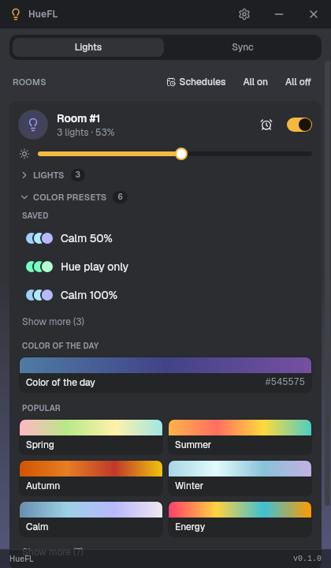<br><sub>Rooms, lights and presets</sub></td>
    <td align="center">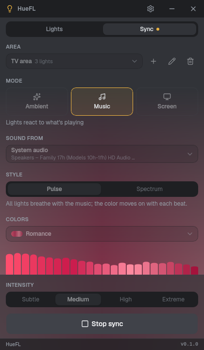<br><sub>Music sync</sub></td>
    <td align="center">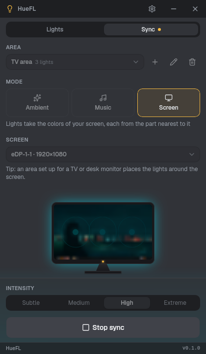<br><sub>Screen sync</sub></td>
  </tr>
</table>

<details>
<summary>Light theme</summary>
<br>
<table>
  <tr>
    <td align="center">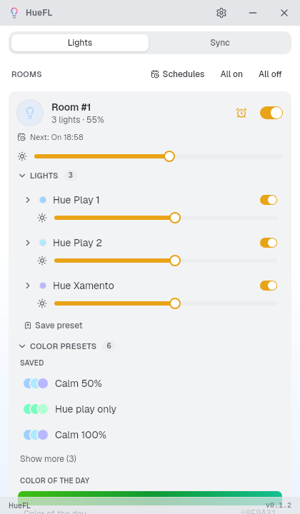<br><sub>Rooms, lights and presets</sub></td>
    <td align="center">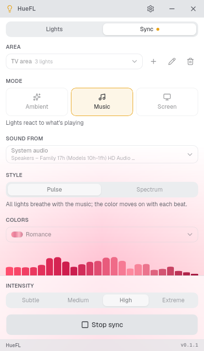<br><sub>Music sync</sub></td>
    <td align="center">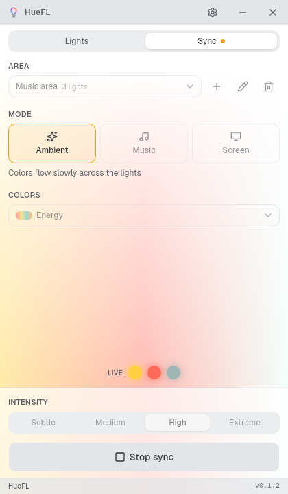<br><sub>Ambient sync</sub></td>
  </tr>
</table>
</details>

## Features

- **Rooms and lights** - on/off, brightness, color wheel and white temperature, per room or per light; changes made elsewhere (the Hue app, a dimmer switch) show up instantly.
- **Color presets** - save a room's look and recall it in one click, edit or rename it later, pick from popular palettes, or use the **Color of the day**.
- **Light sync** over the Hue Entertainment API (~50 updates per second):
  - **Music** - lights follow system audio or a microphone (PulseAudio / PipeWire), with *Pulse* and *Spectrum* styles and a live spectrum view.
  - **Screen** - each light takes the color of the part of the screen it sits by ("ambilight"); X11 and Wayland, with a live preview.
  - **Ambient** - a palette drifting slowly across the lights.
  - A photosensitivity safe mode (on by default) limits flashes to three per second.
- **Schedules that run on the bridge** - on/off at a set time, timers ("turn off in 15 min", "on for 20 min"), and sunrise / sunset with offsets. They keep working with your computer off.
- **Sun and moon view** for your location, picked on an offline world map.
- **System tray** - rooms, sync and the window are one click away; the app keeps running when its window is closed.
- **Private by design** - the bridge key stays on your machine; the bridge certificate is pinned on first use, like SSH.
- **Updates in the app** - new versions are announced in the title bar and installed in place (signed releases).
- Light and dark theme, following the system.

## Status

HueFL is young (version 0.x): usable every day, but expect rough edges and changes between versions. It's tested on Ubuntu 22.04 (GNOME, X11) and SteamOS (KDE Plasma, Wayland) with a Hue Bridge v2. Reports from other setups are very welcome - see [Troubleshooting](#troubleshooting).

## Install

Download the latest release from the [Releases page](https://github.com/iuklaw/huefl/releases).

### AppImage (any distribution, incl. SteamOS)

```bash
chmod +x HueFL_*_amd64.AppImage
./HueFL_*_amd64.AppImage
```

### Debian / Ubuntu (.deb)

```bash
sudo apt install ./HueFL_*_amd64.deb
```

### Releases and updates

Every version is published on the [Releases page](https://github.com/iuklaw/huefl/releases) with its changes, an AppImage and a .deb. Releases are built by [GitHub Actions](https://github.com/iuklaw/huefl/actions/workflows/release.yml) from the tagged source and signed.

HueFL checks for new versions itself (shortly after start and every few hours). When one is out, its number appears next to the app's name in the title bar - click it to see what's new, download and install it, and restart. AppImages update in place; the .deb asks for your password. Automatic checks can be turned off in **Options → About**.

### From source

See [CONTRIBUTING.md](CONTRIBUTING.md#building-from-source).

## Requirements

- **Linux, x86_64** - Ubuntu 22.04 or newer, Debian 12+, Fedora, Arch, SteamOS and others with WebKitGTK 4.1.
- **A Philips Hue Bridge** on the same network. Light sync needs a **Hue Bridge v2** and color lights.
- **System tray** - works out of the box on KDE, Cinnamon, XFCE and Ubuntu's GNOME. On plain GNOME, install the [AppIndicator extension](https://extensions.gnome.org/extension/615/appindicator-support/).
- **Music sync** - PulseAudio, or PipeWire with `pipewire-pulse` (the default on current desktops).
- **Screen sync** - an X11 session, or Wayland with a screen-sharing portal (`xdg-desktop-portal-kde`, `-gnome` or `-wlr`).

## Usage

### First time setup

1. Start HueFL. It looks for bridges on your network (or enter the bridge's IP address).
2. Click **Pair**, then press the round **link button** on top of the bridge within 90 seconds.
3. HueFL pairs as soon as the button is pressed. Your rooms and lights appear.

### Light sync

1. Open the **Sync** tab. A checklist shows what's ready and what's missing.
2. If you don't have one yet, create a **sync area**: choose its purpose, the lights, and where they stand. Areas made in the Philips Hue app work too.
3. Choose a mode - **Ambient**, **Music** or **Screen** - the colors and the intensity, then **Start sync**.

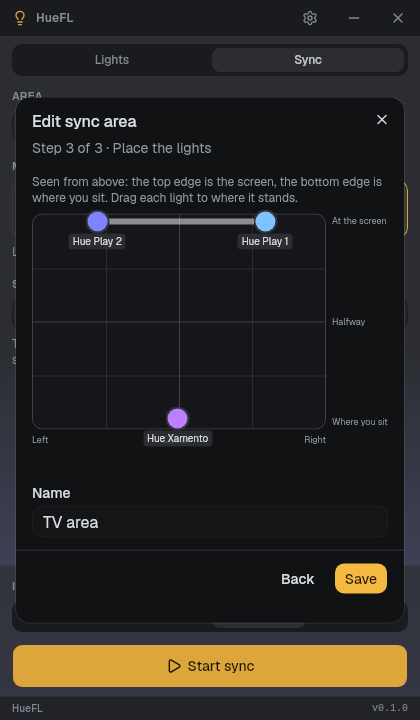

Sync keeps running while the window is in the tray. When it stops, your lights return to how they were.

On Wayland, the first Screen sync asks in a system dialog which screen to share; most desktops remember the choice (**Change screen…** asks again).

<br clear="right">

<details>
<summary>More screenshots</summary>
<br>
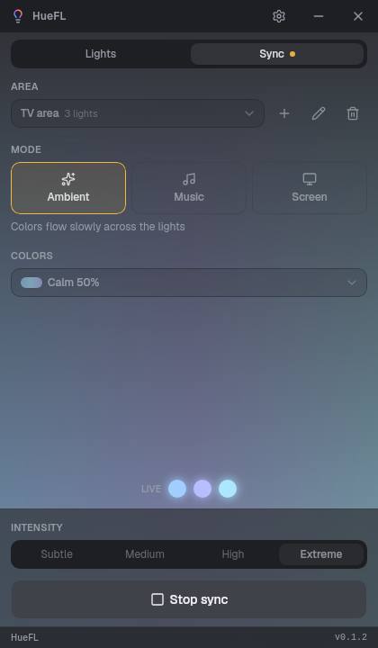
</details>

### Schedules

Use the clock button on a room card for a quick timer, or open **Schedules** for times of day and sunrise / sunset. Set your location there for accurate sun times.

<table>
  <tr>
    <td align="center">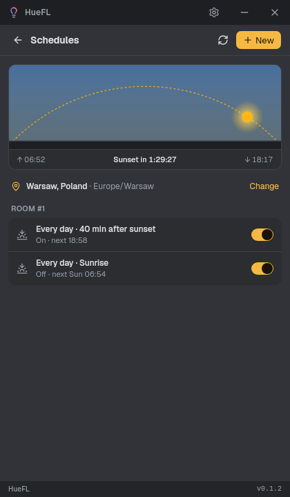<br><sub>Schedules and the sun</sub></td>
    <td align="center">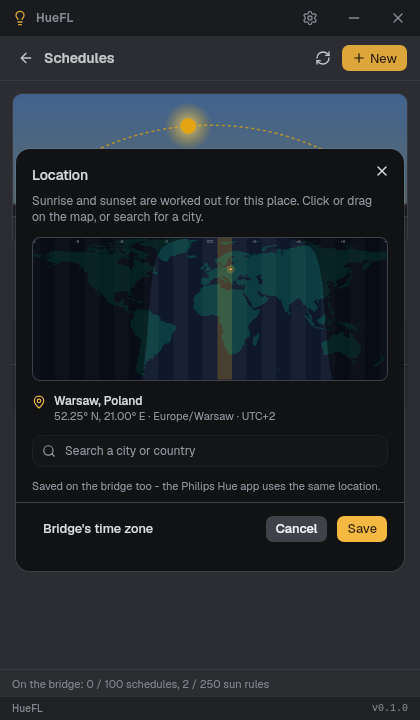<br><sub>Location picker</sub></td>
  </tr>
</table>

## Configuration

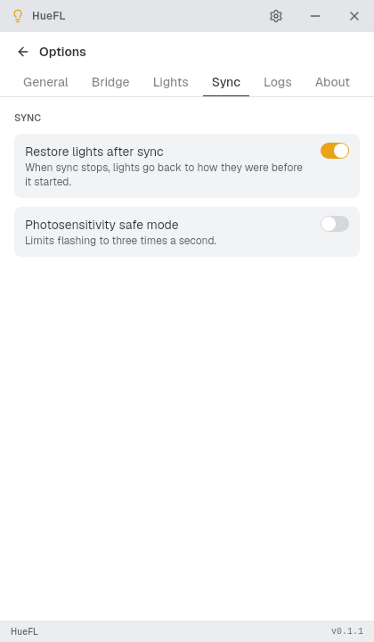

Settings are changed in the app (gear icon → **Options**): closing to the tray, theme, bridge, lights, sync, logs and updates. Files live in the usual places:

| What | Where |
|---|---|
| Settings and the bridge key (mode 600) | `~/.config/huefl/config.json` |
| Log | `~/.local/state/huefl/huefl.log` |

To start HueFL when you log in, create `~/.config/autostart/huefl.desktop`:

```ini
[Desktop Entry]
Type=Application
Name=HueFL
Exec=huefl
Icon=huefl
Terminal=false
```

For the AppImage, set `Exec` to the full path of the file.

<br clear="right">

## Troubleshooting

### No tray icon on GNOME

GNOME needs the [AppIndicator extension](https://extensions.gnome.org/extension/615/appindicator-support/). Ubuntu ships it enabled.

### The bridge isn't found

Make sure the computer and the bridge are on the same network (not a guest Wi-Fi, no VPN in between). HueFL searches with mDNS (`avahi-daemon`) and falls back to Philips' discovery service. You can also enter the bridge's IP address by hand.

### Music sync doesn't react

Check **Sound from** in the Sync tab: *System audio* listens to what your speakers play, *Microphone* to the room. Music sync needs PulseAudio or PipeWire with `pipewire-pulse`; plain ALSA or JACK aren't supported.

### Screen sync is unavailable or black

The warning icon next to **Mode** says why. On Wayland, a screen-sharing portal must be installed; on X11 it works out of the box. If the preview stays black, look for `sync.screen_*` entries in **Options → Logs**.

### Something else

Use **Options → About → Report a bug**, or [open an issue](https://github.com/iuklaw/huefl/issues). The log (**Options → Logs**) helps a lot; bridge keys are removed from it automatically.

## Privacy

HueFL talks to your bridge over your local network only. It contacts the internet for three optional things:

- Philips' bridge discovery service, if no bridge is found locally;
- [colors.zoodinkers.com](https://colors.zoodinkers.com) once a day for the *Color of the day* (only the date is sent);
- GitHub, to check for new versions (can be turned off in **Options → About**).

## Contributing

Bug reports, ideas and pull requests are welcome. See [CONTRIBUTING.md](CONTRIBUTING.md) to build and run HueFL from source.

## License

[MIT](LICENSE)

## Acknowledgements

- Philips Hue and the Hue Entertainment API are trademarks of Signify. HueFL is an independent project, not affiliated with or endorsed by Signify.
- Inspired by projects like [Lumux](https://github.com/enginkirmaci/lumux).
- Built on [Tauri](https://tauri.app), [React](https://react.dev), [shadcn/ui](https://ui.shadcn.com), [SunCalc](https://github.com/mourner/suncalc), [Natural Earth](https://www.naturalearthdata.com) map data and the IANA time zone database.
